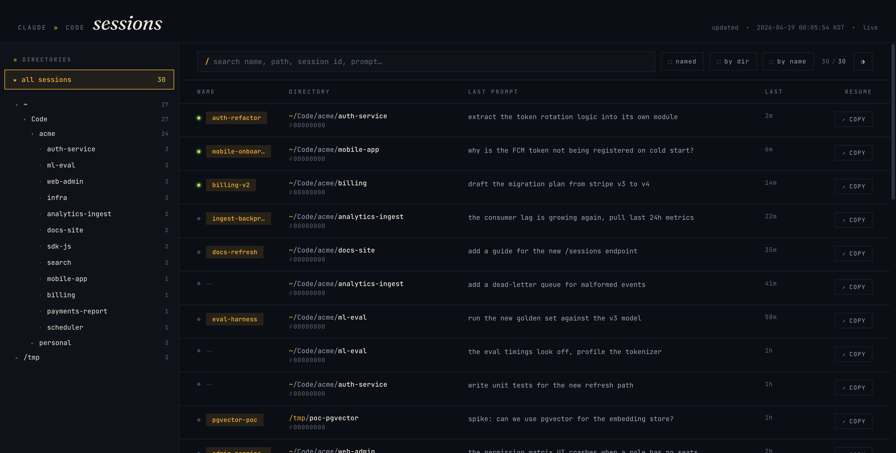

# reclaude

Live browser for your Claude Code sessions.

After a terminal crash, a laptop reboot, or just losing track of where you were,
`reclaude` shows every past session at a glance — custom names (`/rename`),
working directories, last prompt, last activity — so you know exactly where to
`claude --resume`.



## Why

`~/.claude/projects/*/*.jsonl` holds every session you've ever run. It's
durable and complete, but not browsable. `reclaude` reads it live and
surfaces the signal: what did I name this session, which directory was it in,
what was I doing last?

## Install

### Homebrew (macOS, recommended)

```sh
brew tap jadewon/tap
brew install reclaude
```

### From source

Requires Python 3.11+. No third-party packages.

```sh
git clone git@github.com:jadewon/reclaude.git ~/.reclaude
```

## Run

Homebrew install:

```sh
reclaude --port 9999
# or run as a launchd-managed background service:
brew services start reclaude
```

From source:

```sh
python3 ~/.reclaude/reclaude.py
```

Then open http://127.0.0.1:9999/.

Options:

| flag | default | note |
|---|---|---|
| `--port` | `9999` | HTTP port |

## How it works

- **Server** scans `~/.claude/projects/*/*.jsonl` at startup and keeps an
  in-memory map keyed by session ID.
- **Watcher thread** polls file mtimes every 2 s. On change, rescans only the
  affected file(s).
- **Transport** is [Server-Sent Events](https://developer.mozilla.org/en-US/docs/Web/API/Server-sent_events).
  - `event: snapshot` is pushed once on connect (full state).
  - `event: delta` is pushed on change, carrying only `{upsert, remove}` by
    session ID — no full payload re-sends.
- **Client** keeps a `Map` keyed by session ID, applies deltas, re-renders.
- **Search index** is a SQLite-backed character-bigram inverted index at
  `~/.cache/reclaude/index.db`. The watcher builds it lazily — one file per
  tick, only while no browser tab is visible+focused (Page Visibility API
  + window focus). The index handles Korean and English uniformly; results
  stay correct during the initial build because un-indexed and stale files
  fall through to the line-scan verification.

The browser POSTs `/visibility` on visibility/focus changes. Other than that
there are no REST endpoints, no polling from the browser. One long-lived SSE
stream per tab.

## UI

- Left sidebar: directory tree (filters to that subtree on click)
- Toolbar: full-text search (`/`) across session bodies with word-AND fuzzy + `regex` toggle; matches preview the surrounding context with the hit highlighted, `named` filter, `by dir` / `by name` grouping
- Dark + light themes (auto by OS, manual toggle persists)
- Each row: `copy` button writes `cd "<cwd>" && claude --resume <name|id>`
  to clipboard

Preferences (`named-only`, `group-mode`, `theme`, tree expansion, selected
directory) persist in `localStorage`.

## Run as a background daemon (macOS)

Copy the example plist, edit the path to match your clone, load it:

```sh
cp examples/com.github.jadewon.reclaude.plist ~/Library/LaunchAgents/
# edit paths inside the plist if your clone isn't at ~/.reclaude

launchctl load ~/Library/LaunchAgents/com.github.jadewon.reclaude.plist
```

Unload:

```sh
launchctl unload ~/Library/LaunchAgents/com.github.jadewon.reclaude.plist
```

Logs: `/tmp/reclaude.log`, `/tmp/reclaude.err`.

## Data

Read-only. `reclaude` never writes to `~/.claude/`. It only scans for:

- `type: "user"` messages → last prompt
- `type: "custom-title"` / `type: "agent-name"` → session name
- file mtime → activity time
- `cwd` field → working directory
- `~/.claude/sessions/*.json` → active PID detection (green dot)

## License

MIT. See [LICENSE](LICENSE).
